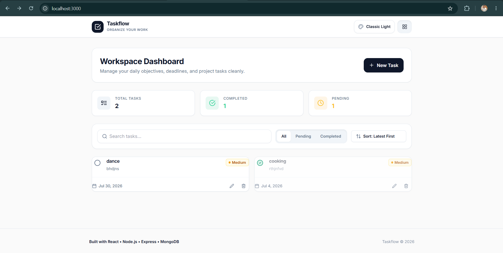
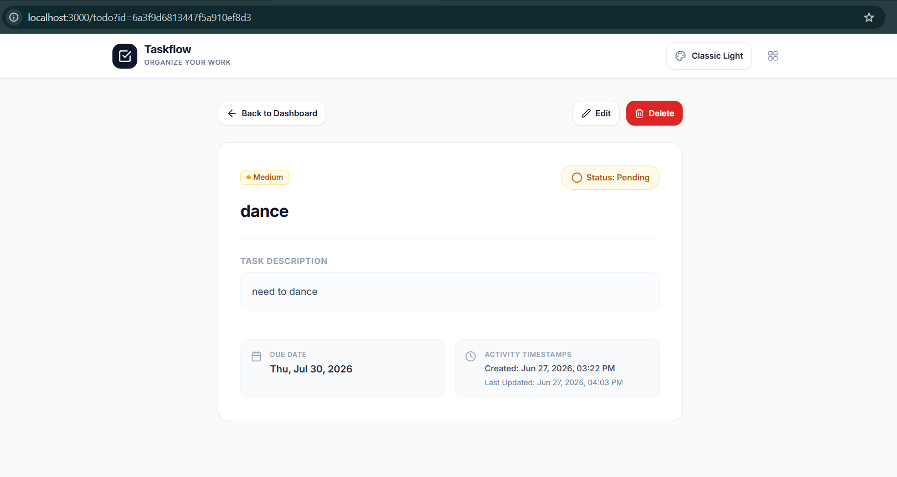

# Taskflow – Full Stack Todo Application




This project was developed as part of the Ziptrrip Full Stack Developer Assessment.

Taskflow is a responsive full-stack task management application built with React, Express.js, and MongoDB. It provides complete CRUD functionality, multi-page navigation, query parameter routing, search, filtering, sorting, theme switching, and a modern responsive interface.

---

## 🚀 Features

### Core Features
- **Create Todo**: Add tasks with title validation, detailed descriptions, priority levels (Low, Medium, High), and due dates.
- **Update Todo**: Edit existing task parameters via modal dialogs or quick completion toggles.
- **Delete Todo**: Remove tasks with an explicit deletion confirmation dialog.
- **Mark Complete / Pending**: One-click status transitions directly from task cards or detail views.

### Productivity Features
- **Real-Time Search**: Query matching task titles, descriptions, and MongoDB ObjectIds.
- **Status Filtering**: Filter views by **All**, **Pending**, and **Completed** tasks.
- **Flexible Sorting**: Order tasks by **Latest First** or **Oldest First**.

### User Experience
- **Responsive Design**: Tailored layouts scaling cleanly across mobile (< 768px), tablet, and desktop viewports.
- **Theme Switching**: Built-in support for 4 color themes with instant transitions and persistent state.
- **Toast Notifications**: Unobtrusive feedback alerts for task operations.
- **Loading Skeletons**: Pulsing placeholder cards during API data fetches.
- **Empty States & 404 Pages**: Polished vectors and user messaging when no tasks are found or invalid IDs are queried.

### Technical Features
- **Multi-Page Routing**: Powered by React Router DOM v6 with `/todo?id=<todoId>` query parameter routes.
- **State Management**: Centralized React Context API (`TodoContext` and `ThemeContext`).
- **MVC Architecture**: Backend organized into Models, Controllers, Services, Routes, and Middleware.
- **MongoDB Persistence**: Schema validation and virtual ID mapping via Mongoose.

---

## 🛠️ Tech Stack

### Frontend
- **Framework**: React 18 (Vite)
- **Routing**: React Router DOM v6
- **State Management**: Context API
- **HTTP Client**: Axios
- **Styling**: Tailwind CSS, PostCSS, Autoprefixer
- **Icons**: Lucide React

### Backend
- **Runtime**: Node.js
- **Framework**: Express.js
- **Architecture**: Model-View-Controller (MVC)
- **Database**: MongoDB (Mongoose ODM)
- **Middleware**: CORS, Custom Operational Error Handler

### Architecture Diagram

```text
React UI
     │
Axios Service
     │
Express Routes
     │
Controllers
     │
Services
     │
Mongoose Models
     │
MongoDB
```

---

## 🎨 Theme Support

Taskflow includes a centralized theme system supporting 4 distinct themes:

- **Classic Light (Default)**: Clean productivity theme inspired by Notion, GitHub, and Linear.
- **Warm Beige**: Warm paper workspace theme inspired by Apple Notes.
- **Forest**: Calm green workspace theme.
- **Dark Professional**: Sleek dark mode inspired by VS Code and Linear Dark.

The selected theme is stored in `localStorage` and automatically restored when reloading the page.

---

## 🔑 Environment Variables

| Variable | Description | Default / Example |
| :--- | :--- | :--- |
| `PORT` | Backend server port | `5000` |
| `MONGODB_URI` | MongoDB connection string | `mongodb://localhost:27017/todo` |
| `VITE_API_URL` | Backend API endpoint | `http://localhost:5000/api` |

---

## 📖 How to Use

1. **Create a Task**: Click **New Task** in the header or dashboard banner to open the creation modal.
2. **Search & Filter**: Use the top control bar to search tasks by title, description, or MongoDB ID, filter by completion status, or sort by date.
3. **View Details**: Click anywhere on a task card to open its dedicated `/todo?id=<todoId>` detail page.
4. **Edit & Delete**: Use the card action buttons or detail page controls to update or delete tasks.
5. **Switch Themes**: Click the palette icon 🎨 in the navigation bar to select your preferred appearance.

---

## 📁 Repository Structure

```
todo-app/
├── frontend/
│   ├── src/
│   │   ├── components/      # Reusable UI components (Navbar, Footer, TodoCard, Modals, etc.)
│   │   ├── pages/           # Page routes (TodoListPage, TodoDetailPage)
│   │   ├── services/        # Axios API client (todoService.js)
│   │   ├── context/         # React Context API (TodoContext.jsx, ThemeContext.jsx)
│   │   ├── App.jsx          # Router declarations
│   │   └── main.jsx         # Application entry point
│   ├── .env.example         # Environment variable template
│   └── package.json
├── backend/
│   ├── config/              # MongoDB connection configuration (db.js)
│   ├── controllers/         # HTTP Request handlers (todoController.js)
│   ├── middleware/          # Centralized error handling middleware
│   ├── models/              # Mongoose Todo schema (Todo.js)
│   ├── routes/              # Express API endpoints (todoRoutes.js)
│   ├── services/            # Mongoose query layer (todoService.js)
│   ├── utils/               # Operational error utility (appError.js)
│   ├── .env.example         # Environment variable template
│   ├── server.js            # Node server boot process
│   └── package.json
├── screenshots/             # Visual interface captures
├── README.md                # Main documentation
├── FEATURES.md              # Detailed feature specification breakdown
├── API.md                   # REST API endpoint documentation
├── LICENSE                  # MIT License
└── .gitignore
```

---

## ⚙️ Installation & Setup

### Prerequisites
- Node.js (v16+ recommended)
- MongoDB instance (local MongoDB server or MongoDB Atlas URI)

### 1. Backend Setup
```bash
# Navigate to backend directory
cd backend

# Install dependencies
npm install

# Create environment configuration file
cp .env.example .env
```

Configure `.env` with your settings:
```env
PORT=5000
MONGODB_URI=mongodb://localhost:27017/todo
```

Start the backend development server:
```bash
npm run dev
```
The server will start at `http://localhost:5000`.

### 2. Frontend Setup
```bash
# Navigate to frontend directory
cd ../frontend

# Install dependencies
npm install

# Create environment configuration file
cp .env.example .env
```

Configure `.env` with your settings:
```env
VITE_API_URL=http://localhost:5000/api
```

Start the frontend Vite dev server:
```bash
npm run dev
```
The application will open at `http://localhost:3000`.

---

## 🌐 API Overview

| Method | Endpoint | Description |
| :--- | :--- | :--- |
| `GET` | `/api/todos` | Fetch all todos (supports query params `search`, `status`, `sort`) |
| `GET` | `/api/todos/:id` | Fetch a single todo by ID |
| `POST` | `/api/todos` | Create a new todo item |
| `PUT` | `/api/todos/:id` | Update an existing todo by ID |
| `DELETE` | `/api/todos/:id` | Delete a todo by ID |

For full request payloads, sample JSON responses, and status code details, refer to [API.md](API.md).

---

## 📸 Screenshots

| Dashboard View | Task Details View |
| :---: | :---: |
|  |  |

*(Additional screenshots available in the `screenshots/` directory)*

---

## 🚀 Deployment Guide

### Frontend Deployment (Vercel)
1. Push your repository to GitHub.
2. Import the project in Vercel and set the Root Directory to `frontend`.
3. Add Environment Variable: `VITE_API_URL=https://your-backend-service.onrender.com/api`.
4. Deploy.

### Backend Deployment (Render)
1. Create a new Web Service on Render connected to your repository.
2. Set Root Directory to `backend`.
3. Build Command: `npm install`. Start Command: `node server.js`.
4. Add Environment Variable: `MONGODB_URI` pointing to your MongoDB Atlas cluster connection string.
5. Deploy.

---

## 🔮 Future Enhancements

- **User Authentication**: JWT-based login and registration for multi-user task isolation.
- **Task Categories & Labels**: Custom tags and colored labels for project categorization.
- **Drag and Drop Reordering**: Kanban board layout with interactive task reordering.
- **Due Date Reminders**: Automated email and browser push notifications for upcoming deadlines.

---

## 🤝 Contributing

Contributions, suggestions, and improvements are welcome. Please feel free to fork the repository and submit a pull request.

---

## 📜 License

This project is open-source under the [MIT License](LICENSE).
